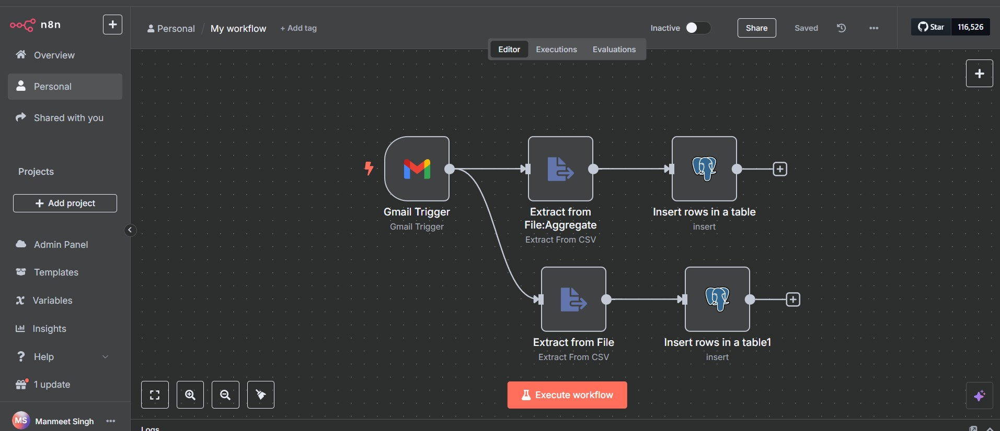
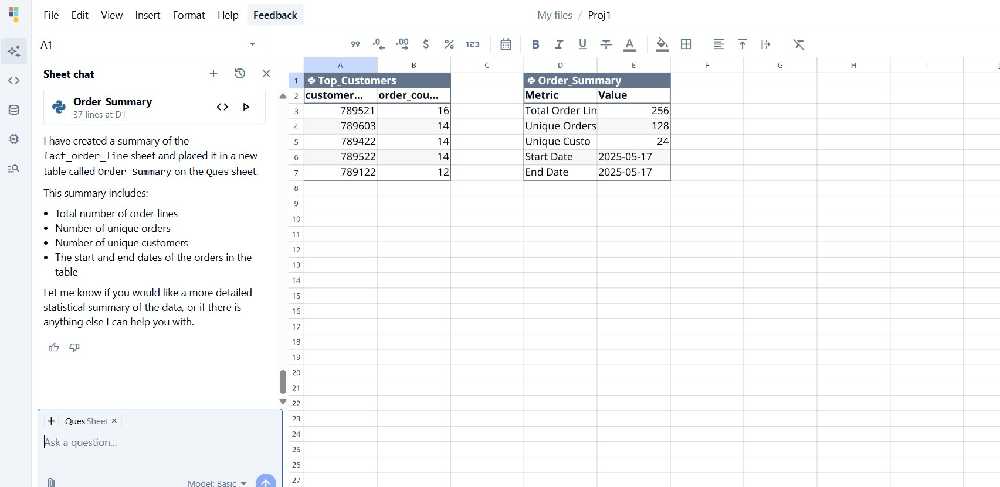
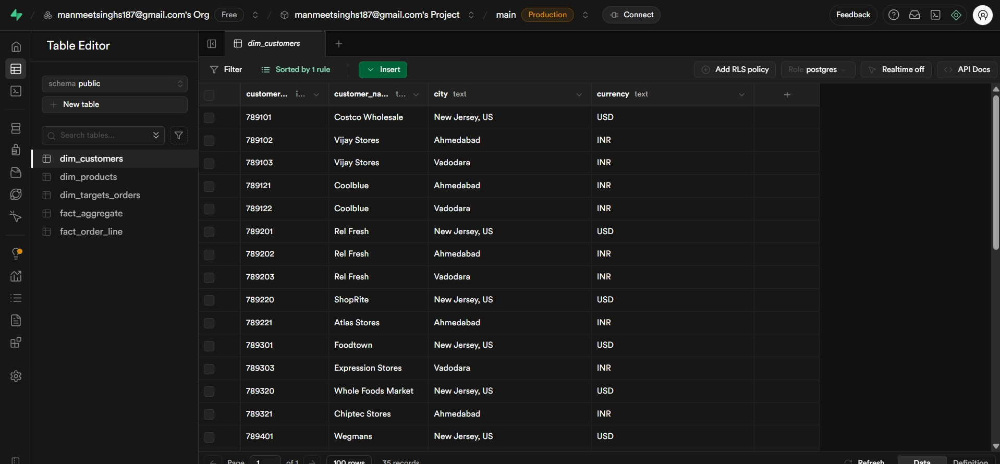

 🧠 Natural Language Query Engine

> A no-code/low-code **Natural Language to SQL query engine** powered by **n8n**, **Quadratic AI**, and **Supabase**.  
> Users can ask natural language questions, and the system returns structured data from a database.

 🖼️ Preview

 🌐 n8n Workflow

 📤 AI to SQL using Quadratic

 🗃️ Supabase Data Response

 🔍 How It Works

1. 🧑‍💬 User types a natural language question (e.g., _“Show me all orders from last week”_)
2. 🔁 n8n receives input via webhook or UI form
3. 🧠 Quadratic AI converts the sentence into a SQL query
4. 🧪 n8n executes the query using Supabase Postgres database
5. 📊 Results are returned to the user via webhook, Telegram, email, or frontend

 ⚙️ Technologies Used

| Tool       | Role                         |
|------------|------------------------------|
| **n8n**    | Workflow automation and orchestration |
| **Supabase** | PostgreSQL database with RESTful API |
| **Quadratic** | AI engine for translating text to SQL |
| **Webhook/UI** | Frontend or user input trigger |

 🚀 Getting Started

 🛠️ Prerequisites

- n8n (cloud or local)
- Supabase account & database
- Quadratic API or LLM service with SQL generation capability
- Optional: Webhook-based UI or chatbot interface
 🔧 Setup Flow

1. Clone this repo:
   
   git clone https://github.com/Manmeets2/Natural-Language-Query-Engine.git

2. Configure environment variables:

   * Supabase URL and API key
   * Quadratic API or LLM service
   * Your DB schema reference (can be manually defined or fetched from Supabase)

 🧪 Example Use Cases

* 📊 "Show me all users from Delhi"
* 🧾 "What are the top 5 products by revenue?"
* 📉 "List failed login attempts in last 24 hours"
* 🗓️ "Get appointments scheduled for next Monday"

 ✨ Future Improvements

* [ ] Integrate OpenAI/GPT for richer SQL interpretation
* [ ] Voice-to-query integration
* [ ] Save & audit query history
* [ ] Add auth control and error handling
* [ ] Deploy to production (Vercel or backend app)

> *“Query smarter, not harder — unlock databases with just your words.”*

